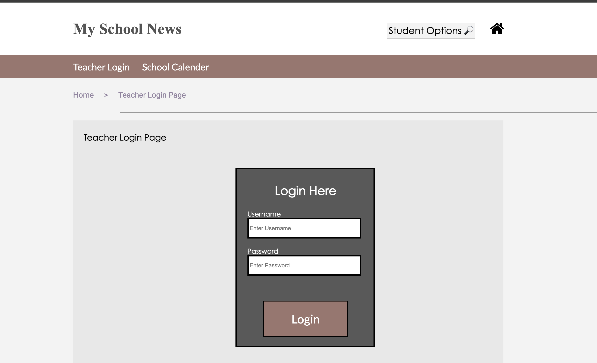

# School Announcement Program

Welcome to the School Announcement Program! This web application is designed to facilitate communication within a school, allowing teachers to post announcements targeted to specific grades, clubs, and genders, while students can easily view these announcements.

## Features

- **Login Page for Teachers:** Secure login for teachers to access the announcement posting features.
- **Create Announcement:** Teachers can create and tailor announcements for specific groups of students.
- **Post Announcement:** Announcements can be posted and made visible to the targeted audience.
- **View Announcement:** Students can view relevant announcements based on their grade, club membership, or gender.
- **School Calendar:** An interactive calendar displaying important school events and announcements.

## Technologies Used

- **HTML**
- **CSS**
- **JavaScript**

## Installation

To install and set up the project locally, follow these steps:

1. **Clone the repository:**
   ```bash
   git clone https://github.com/aryanp05/school-announcement-program.git
   ```
2. **Navigate to the project directory:**
   ```bash
   cd school-announcement-program
   ```
3. **Open `newsHomePage.html` in your preferred web browser:**
   ```bash
   open index.html
   ```

Note: Since the project uses HTML, CSS, and JavaScript, no additional setup or server configuration is required.

## Usage

Once you have the project open in your web browser, you can:

- **Login as a Teacher:** Use the login page to enter your credentials and access the announcement creation features.
- **Create and Post Announcements:** Navigate to the announcement creation page to draft and post your messages.
- **View Announcements:** Students can view the announcements on the homepage or through the targeted announcement sections.
- **Interact with the Calendar:** Check the school calendar for upcoming events and important dates.

## Screenshots


   
   
   


## License

This project is licensed under the MIT License. See the [LICENSE](LICENSE) file for more details.

## Contact Information

For questions or support, please contact me at:

- **Email:** [a236pate@uwaterloo.ca](mailto:a236pate@uwaterloo.ca)
- **LinkedIn:** [linkedin.com/in/aryanpatel05](https://linkedin.com/in/aryanpatel05)
